# 1.介绍

## 这一章是一个混合章节，我们将学习动画，命令和linq等等技术

# 2.动画1，用xaml制作动画

## 学习内容

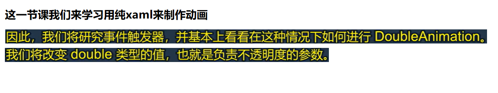

## 项目演练

## 1.新建一个项目，起名：xamlanimationdemo

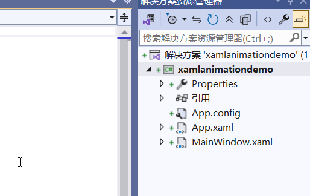

## 2.然后我们给Grid元素添加触发器集，然后添加一个事件触发器，在里面添加一个BeginStoryBoard标签，在并且里面添加一个StoryBoard标签然后在里面添加一个DoubleAnimation动画

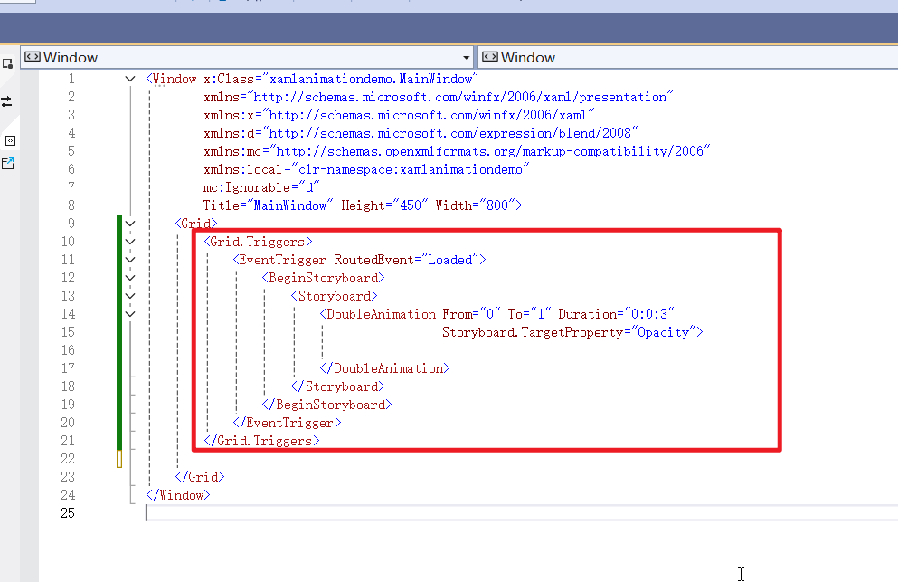

## 3.然后我们在Grid里面添加一幅图片

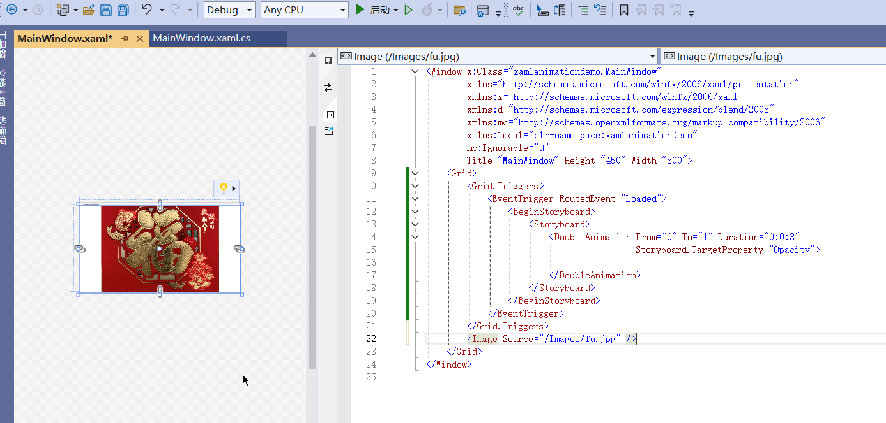


## 4.RoutedEvent有一些选项，

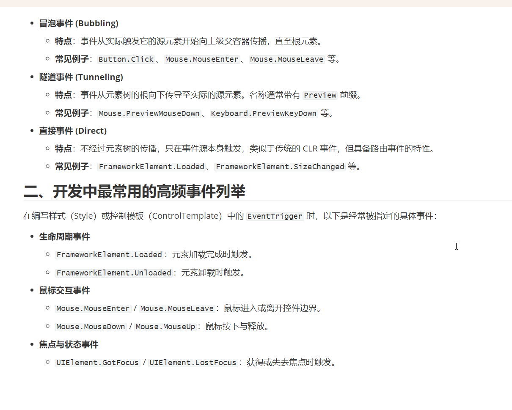

## 5.比如我们可以把这里的RoutedEvent改为"MouseEnter"

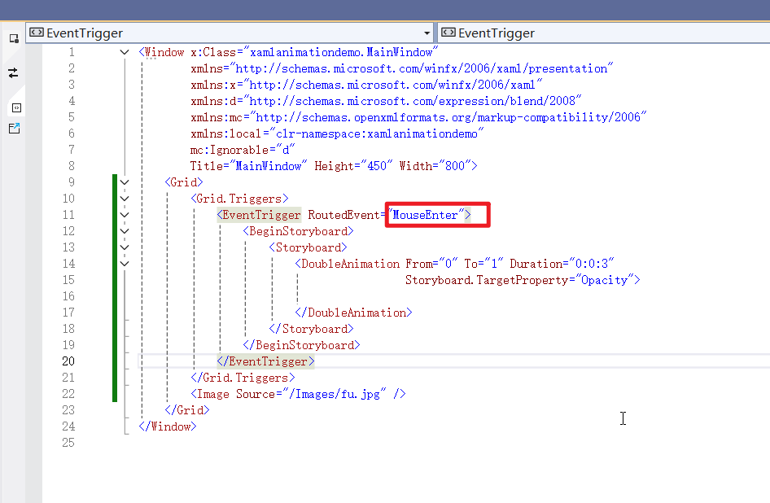

### 效果，当我们把鼠标移到图片里面，图片会先消失然后再慢慢出现，持续我们设置的时间


# 3.动画2，用c#制作动画

## 下一节我们尝试用csharp代码来实现动画，

## 1.新建一个wpf项目，起名：csharp-animatin-demo

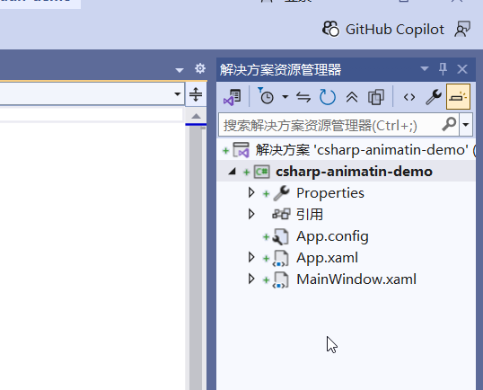


## 2.创建一个StackPanel，把Grid放到它的里面，然后给Grid创建一个标签，并且给Grid起名AniGrid还要给它的Loaded事件添加处理函数，然后在Grid下面创建一个TextBlock这个元素不设置动画效果，只是用来做对比

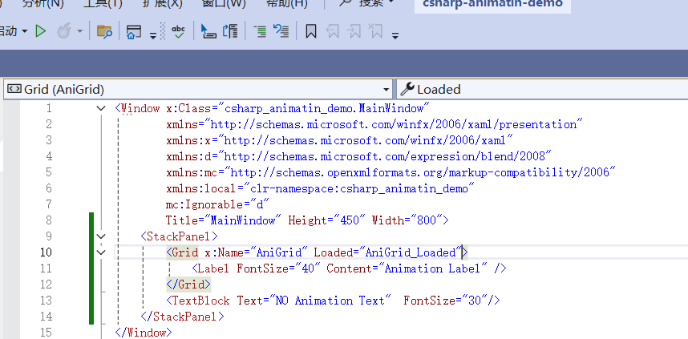

## 3.我们需要做的就是在Grid的Loaded事件处理函数里面实现动画效果，代码如下

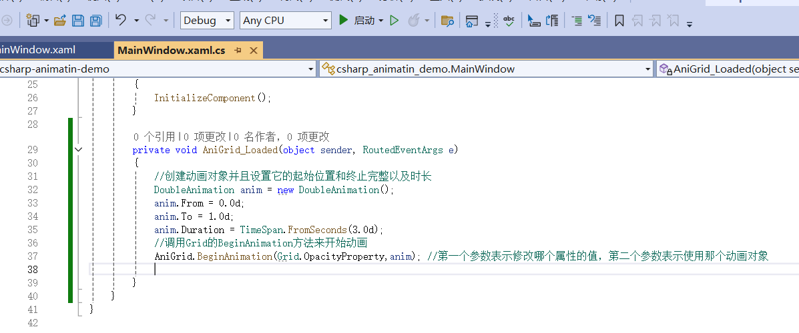

### 效果

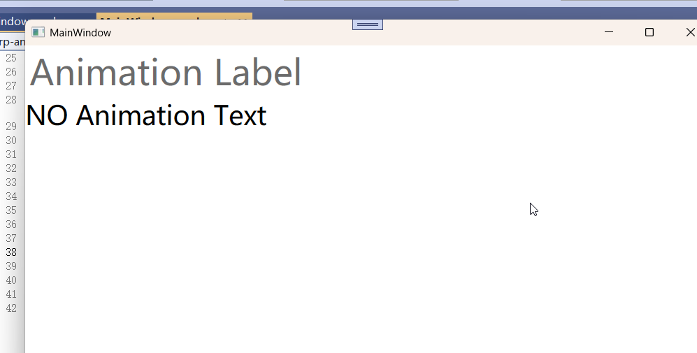

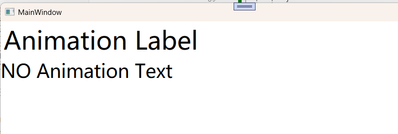

## 4.我们也可以创建于一个用于修改Grid背景的动画，此时需要ColorAnimation，并且需要2个步骤，第一个就是给Grid创建一个背景对象，填充一个颜色，比如白色，然后我们对这个背景对象使用BeginAnimation方法来改变背景对象的颜色

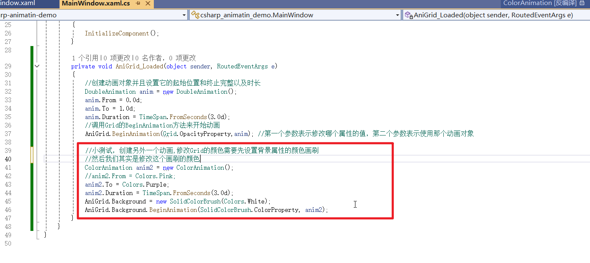

### 效果

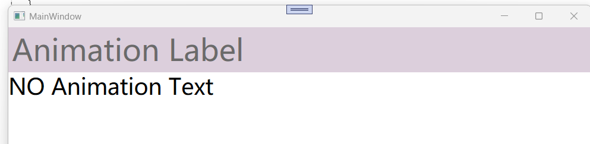

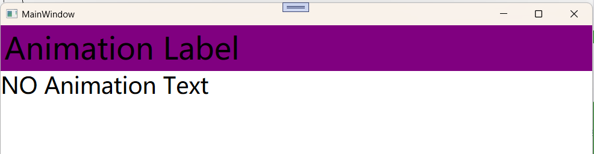

## 5.我们还可以在MouseEnter事件里面使用动画

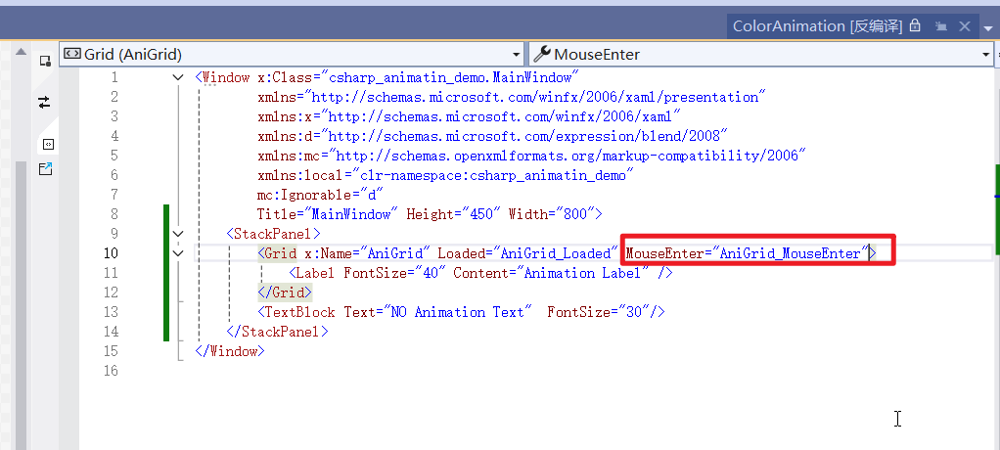


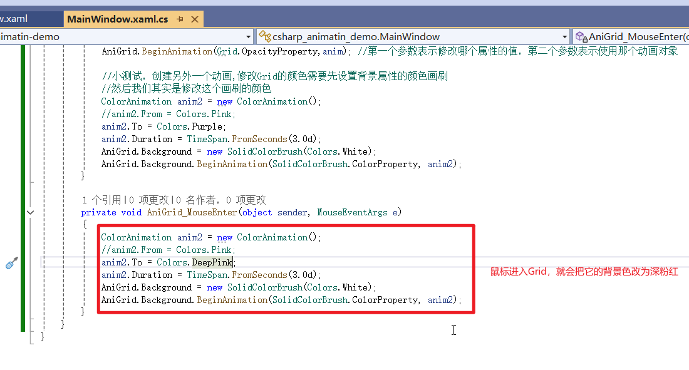

### 效果

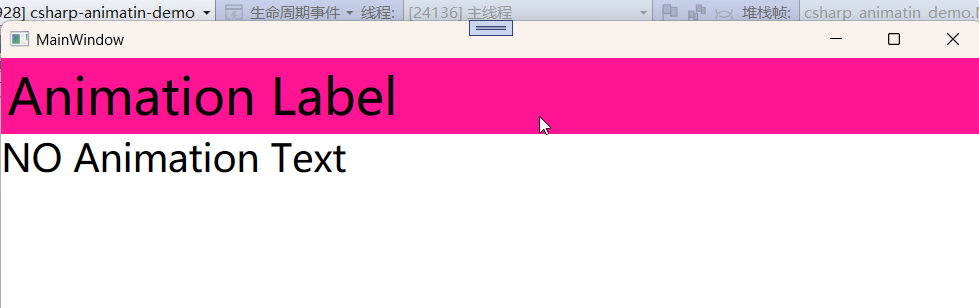

## 微软官方参考案例（.net core）： https://github.com/microsoft/WPF-Samples

## 微软官方参考案例（.net framework): https://github.com/microsoft/WPF-Samples/tree/netframework

****

# 4.命令1-设置关闭命令

## 1.关于命令


## 2.命令的作用

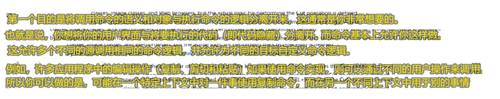

## 这一节我们来学习关闭命令

### 1》创建一个wpf项目，起名closecmddemo

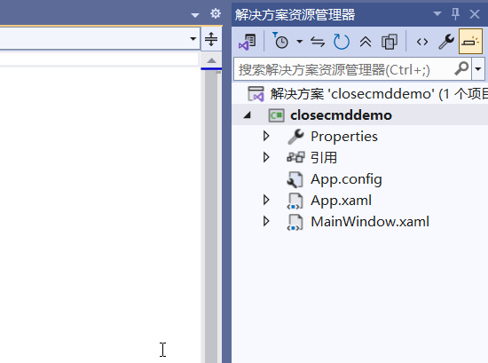


### 2>把Grid改为StackPanel，然后在里面添加一个按钮，设置它的命令为ApplicationCommands.Close

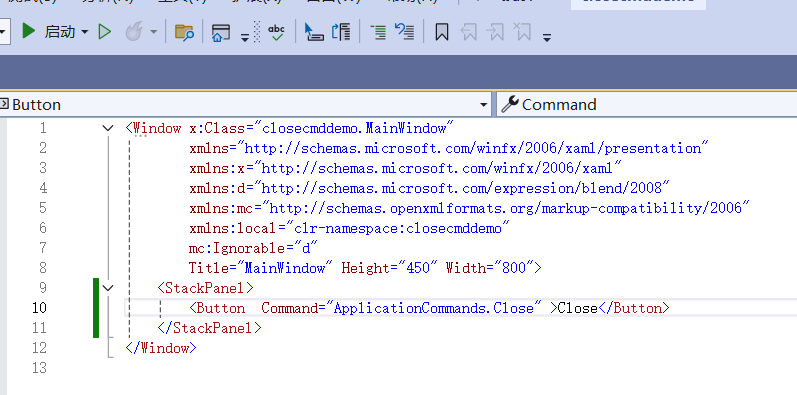

### 3》运行程序，你会发现，此时这个按钮是灰色的，不能点击

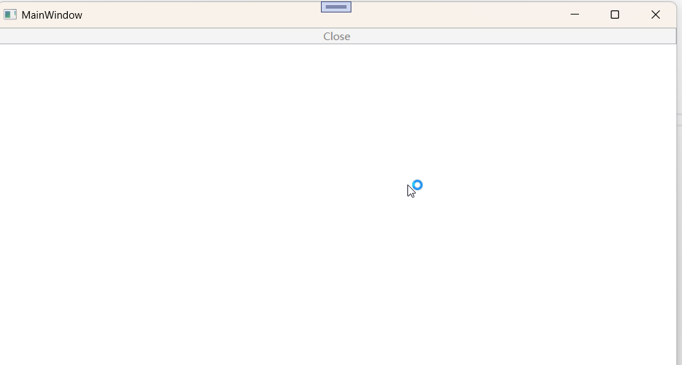

### 4》然后我们可以给Window设置一个命令绑定，注意需要沟通创建执行函数和可以执行函数

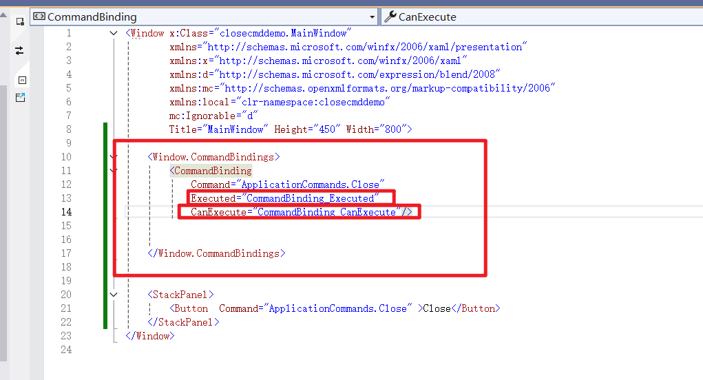


### 5》然后我们进入后Window的台代码，给这两个函数添加代码

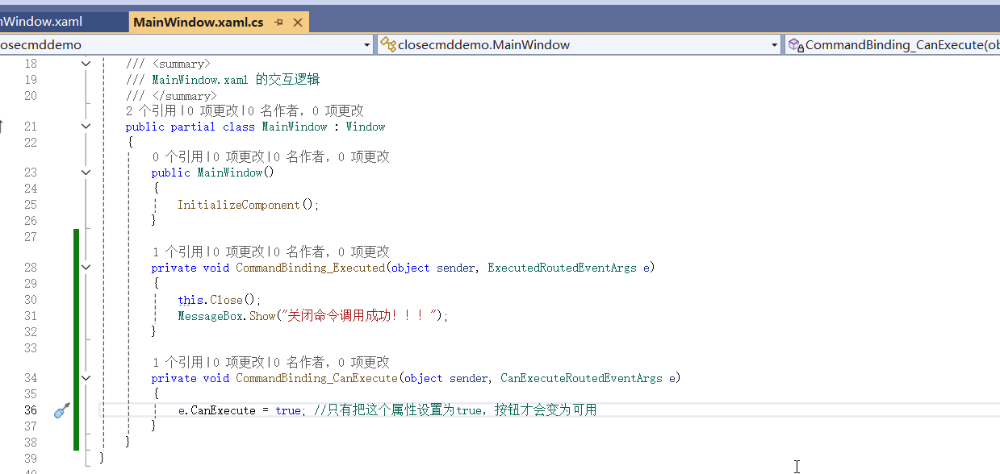


### 6》运行程序，效果如下

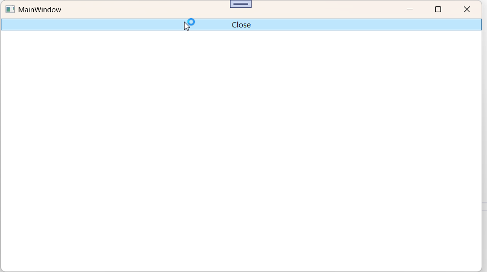

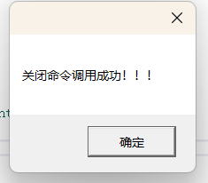


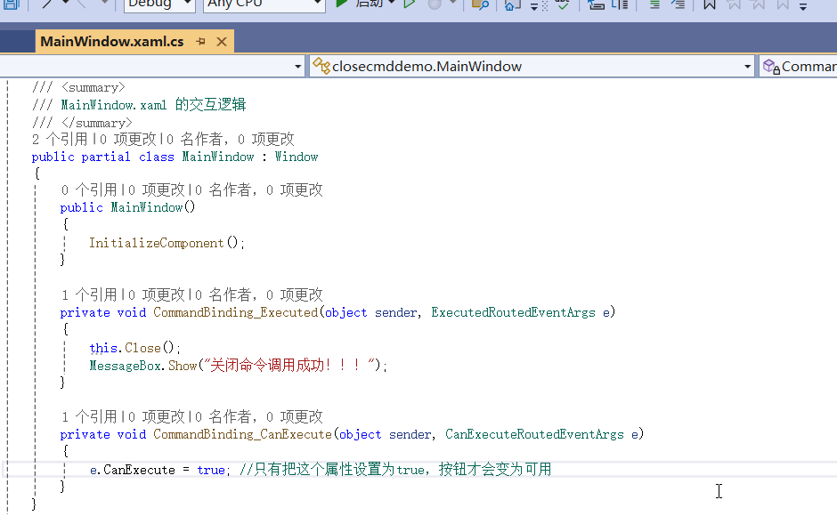


## 扩展，wpf命令

WPF 命令（Command）是一种基于 `ICommand` 接口的语义化输入机制，用于将 UI 动作与底层业务逻辑解耦。 [[1](https://www.wpfsoft.com/command), [2](https://cloud.tencent.com/developer/article/1897776), [3](https://juejin.cn/post/7540285101180764187)]

四大核心概念

- **命令（Command）**：要执行的操作（实现 `ICommand` 的对象）。
- **命令源（Command Source）**：触发命令的对象（如 `Button`、`MenuItem`）。
- **命令目标（Command Target）**：命令执行操作的元素（如 `TextBox`）。
- **命令绑定（Command Binding）**：将路由命令与处理逻辑映射起来的桥梁。 [[1](https://learn.microsoft.com/zh-cn/dotnet/desktop/wpf/advanced/commanding-overview), [2](https://www.cnblogs.com/zhili/p/WPFCommand.html), [3](https://zhuanlan.zhihu.com/p/415621317)]

核心接口与分类

- **`ICommand` 接口**包含三个成员：`Execute`（执行逻辑）、`CanExecute`（是否可执行判断）和 `CanExecuteChanged`（状态改变通知）。
- **内置命令**（类）：如 [MediaCommands](https://learn.microsoft.com/zh-tw/dotnet/api/system.windows.input.mediacommands)、[ApplicationCommands](https://learn.microsoft.com/zh-tw/dotnet/api/system.windows.input.applicationcommands)、[NavigationCommands](https://learn.microsoft.com/zh-tw/dotnet/api/system.windows.input.navigationcommands)、[ComponentCommands](https://learn.microsoft.com/zh-tw/dotnet/api/system.windows.input.componentcommands)和[EditingCommands](https://learn.microsoft.com/zh-tw/dotnet/api/system.windows.documents.editingcommands)。，自带快捷键和状态管理。
- **自定义命令（MVVM 常用 `RelayCommand` / `DelegateCommand`）**：在 ViewModel 中定义，供 View 绑定。 [[1](https://learn.microsoft.com/zh-tw/dotnet/desktop/wpf/advanced/commanding-overview), [2](https://www.reddit.com/r/dotnet/comments/vycx3a/command_responsibilities_in_wpf_mvvm_pattern/?tl=zh-hant), [3](https://www.wpfsoft.com/command), [4](https://cloud.tencent.com/developer/article/1897776)]

快速实现步骤（MVVM 自定义命令）

1. 创建实现 `ICommand` 的类（或使用常用框架如 Prism、CommunityToolkit.Mvvm 的 `RelayCommand`）。
2. 在 **ViewModel** 中声明 `ICommand` 属性并在构造函数中初始化委托。
3. 在 **View** 的控件中通过 **`Command="{Binding YourCommandName}"`** 进行绑定。
4. （可选）设置 **`CommandParameter="{Binding ElementName=...}"`** 传递参数


### wpf命令参考网址： https://learn.microsoft.com/zh-tw/dotnet/desktop/wpf/advanced/commanding-overview#commands_at_10000_feet

### wpf命令英文参考网址：https://learn.microsoft.com/en-us/dotnet/desktop/wpf/advanced/commanding-overview#simple_command


# 5.linq简介

## 官方参考：https://learn.microsoft.com/en-us/dotnet/csharp/linq/

## 什么是linq？

**LINQ**（全称 **Language Integrated Query**，即**语言集成查询**）是微软在 .NET Framework 3.5（C# 3.0 / VB.NET 9.0）中引入的一项强大技术。它将数据查询功能直接集成到编程语言（如 C# 和 F#）中，让开发者能够使用统一、强类型、具表现力的语法去操作和转换各种类型的数据源，而无需在代码中编写容易出错的纯字符串 SQL 或 XML 查询语句。

 

核心特性与优势

- **统一的查询体验**：无论是内存中的对象集合（如 List、Array）、关系型数据库（如 SQL Server） 还是 XML 文档，都可以使用相同的语法模式进行查询。

   

- **编译时类型检查**：查询表达式中的变量是强类型，拼写错误或类型不匹配会在编译时被捕获，彻底摆脱传统字符串查询的“运行时除错地狱”。

   

- **智能感知（IntelliSense）支持**：在 IDE（如 Visual Studio / VS Code）中编写查询时，享有完整的代码自动完成和属性提示。

   

- **延迟执行（Deferred Execution）**：许多 LINQ 查询在定义时并不会立刻去数据库或内存中检索数据，而是在真正对其进行迭代（如 `foreach`）或调用聚合函数时才执行，有效优化性能。

   

常见的 LINQ 语法形式

1. **查询语法（Query Syntax）**：类似 SQL 的声明性语法，可读性极高。

   csharp

   ```
   var results = from p in programmers 
                 where p.IsNewToLINQ 
                 select new LINQExpert(p);
   ```

   它的意思是：**从 `programmers`（程序员）集合中筛选出所有 `IsNewToLINQ` 为 `true`（即刚接触 LINQ）的程序员，并将他们转换为 `LINQExpert`（LINQ专家）对象的新实例，最后返回这个新对象构成的集合。**

2. **方法语法（Method Syntax）**：基于 Lambda 表达式的高阶函数 API，更加灵活和紧凑。

   csharp

   ```
   var results = programmers.Where(p => p.IsNewToLINQ)
                            .Select(p => new LINQExpert(p));
   ```

    

常见分类（LINQ 提供程序）

- **LINQ to Objects**：针对内存中的 `IEnumerable<T>` 集合（如数组、列表）进行查询。
- **LINQ to SQL / Entities**：将 LINQ 查询翻译为底层的 SQL 语句，直接对关系型数据库进行操作（如 Entity Framework Core）。
- **LINQ to XML**：专门用于查询和修改 XML 文档的模型

## 项目演练

### 1.新建一个项目，起名LinqDemo，把Grid改为StackPanel，然后在里面添加另外一个StackPanel，把排列方向改为水平，然后在里面添加一个查询列表的按钮

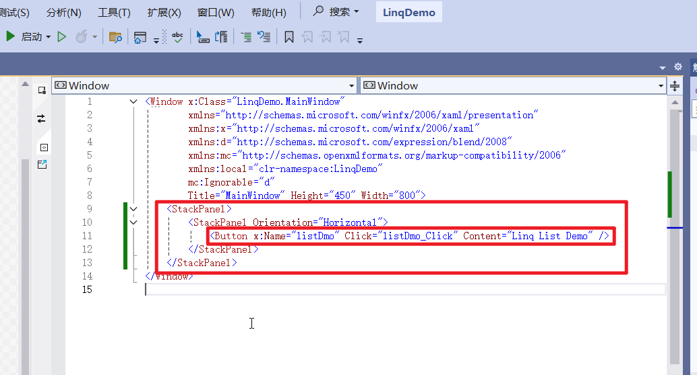

### 2.给按钮添加一个点击事件处理函数，在里面使用linq查询来获取列表中大于80的值

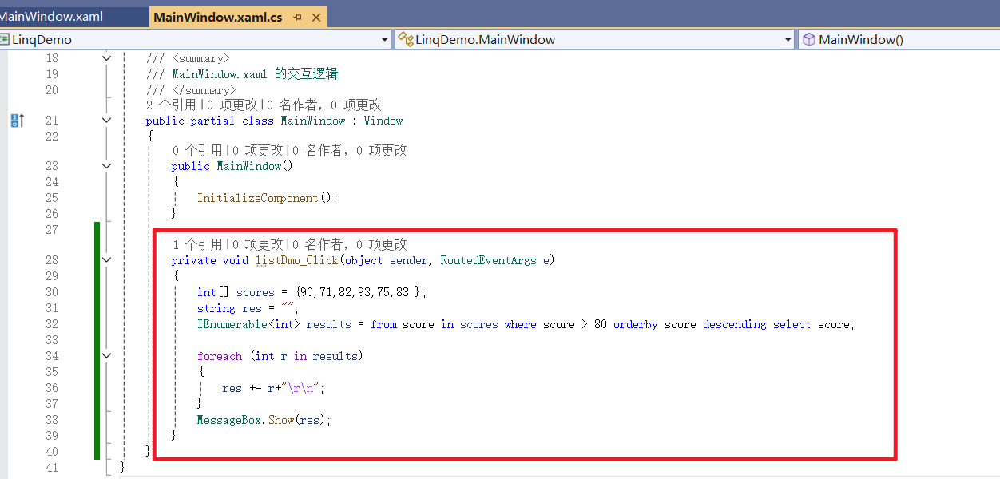

### 为了方便查看效果我们把窗口设置小一点

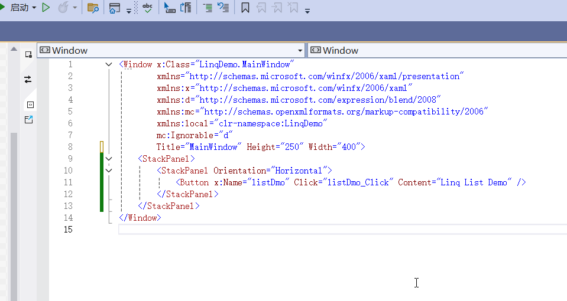

### 3.运行程序，效果如下

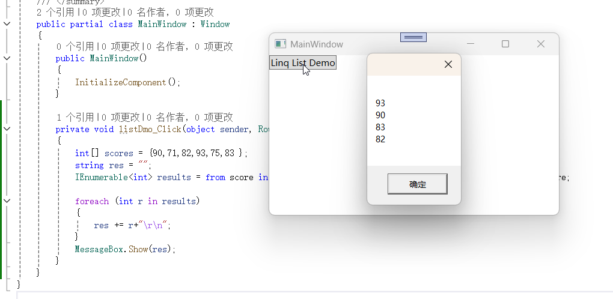

#### 注意，linq语句必须以select或者groupby结尾，否则报错

## 4我们来学习第二种查询方法，创建另外一个按钮并且添加事件处理函数

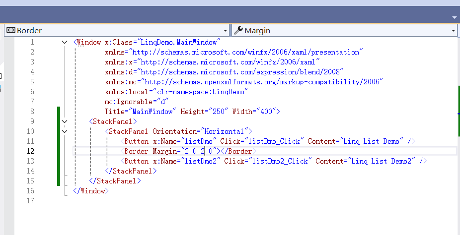

### 5.然后我们实现这个按钮的点击事件处理函数

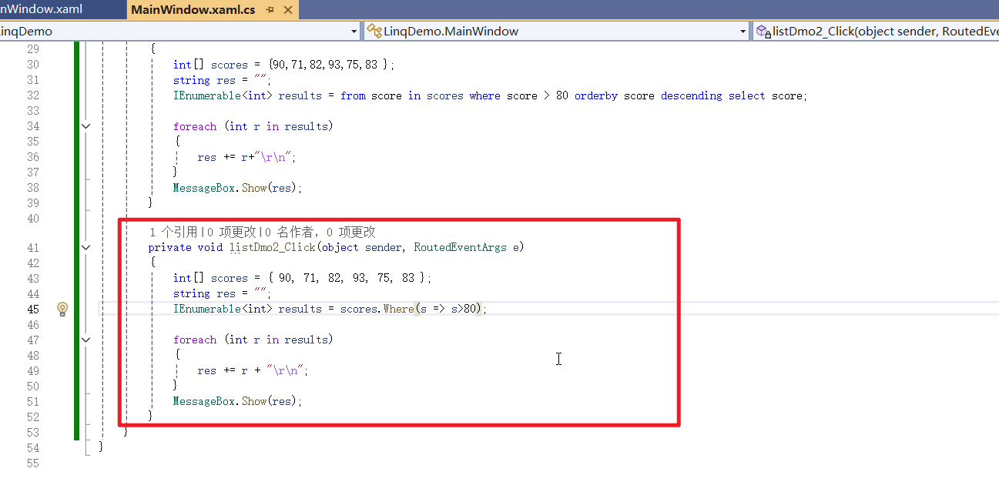

### 6.运行程序，效果如下。

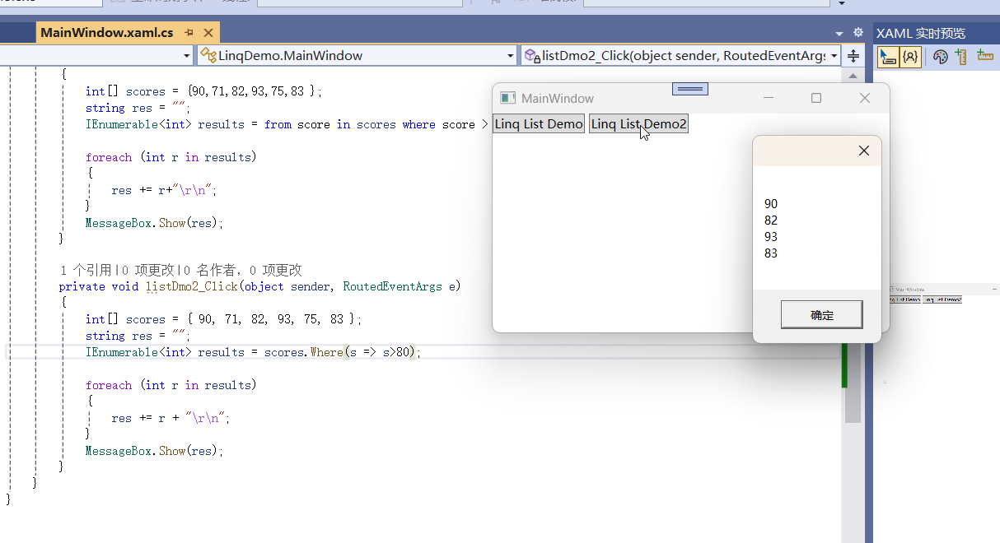


### 7.排序也是可以的

#### 7.1升序排列

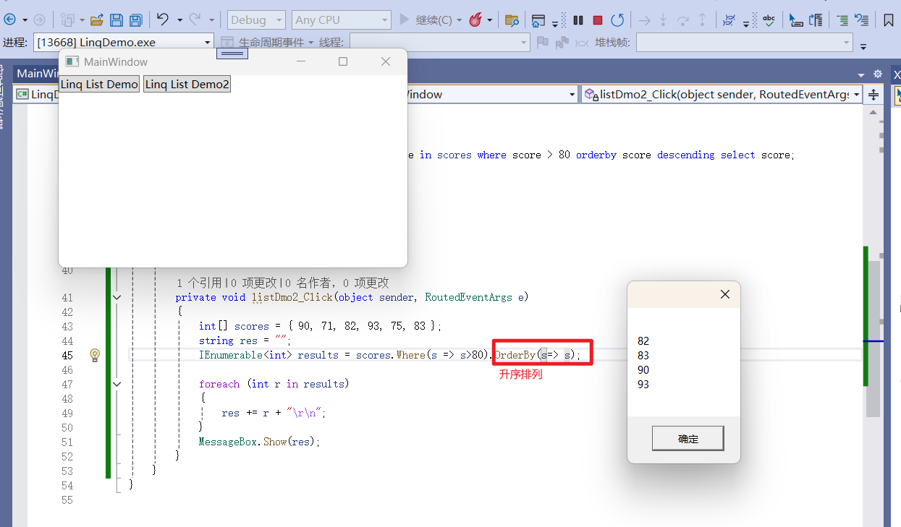

#### 7.2 降序排列

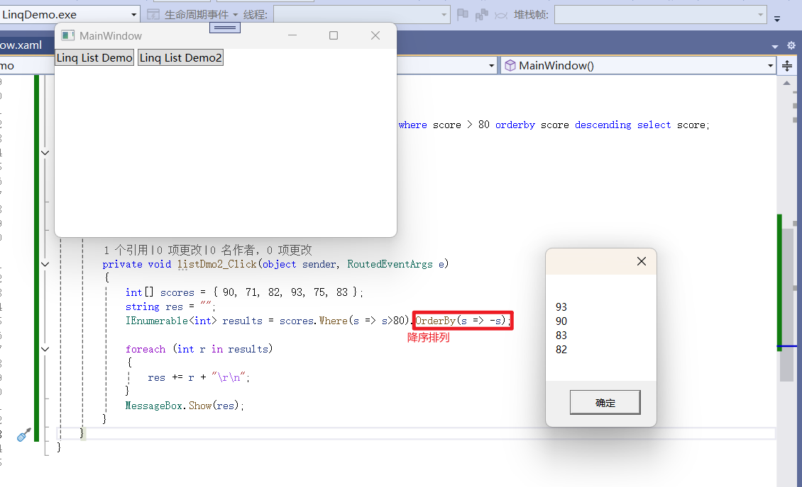

# 6.筛选奇数和偶数

## 1.这一节课，我们来学习使用linq来获取一个集合中的所有奇数和偶数，还是使用上面的案例，我们添加另外一个StackPanel，在里面添加三个按钮，并且添加事件处理函数

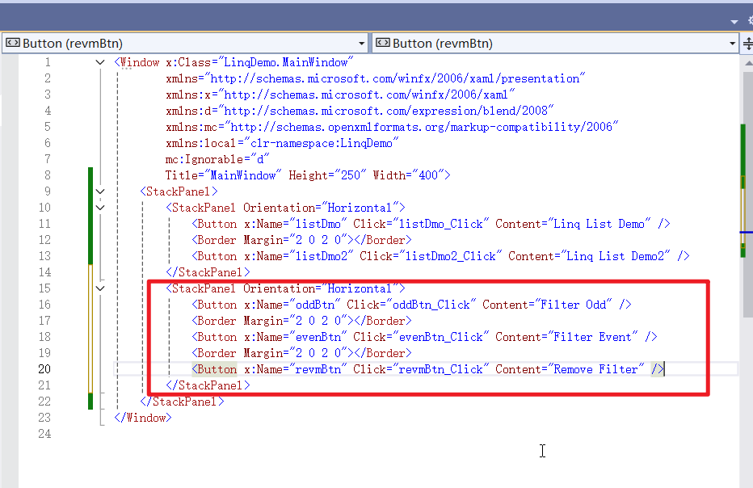

## 2.此外，我们还可以添加一个TextBlock用来显示结果

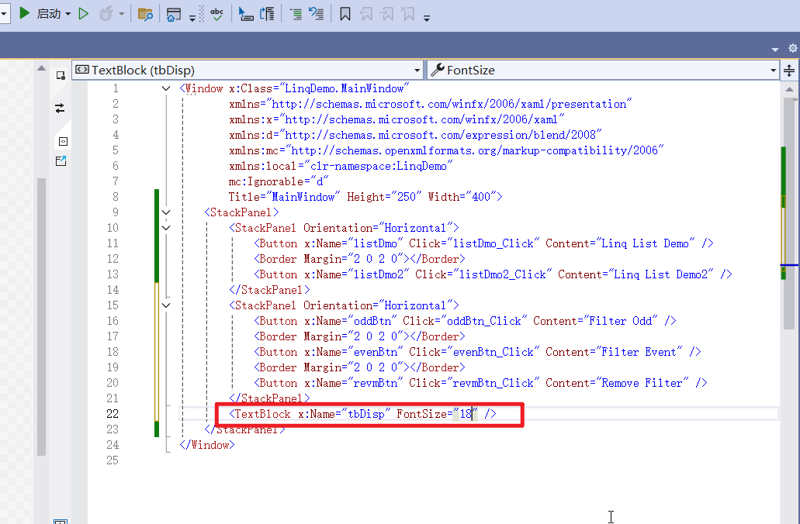

## 3.然后我们来添加按钮的点击事件处理代码，注意需要先定义一个公共属性Nums，是一个实例化了的整型数组

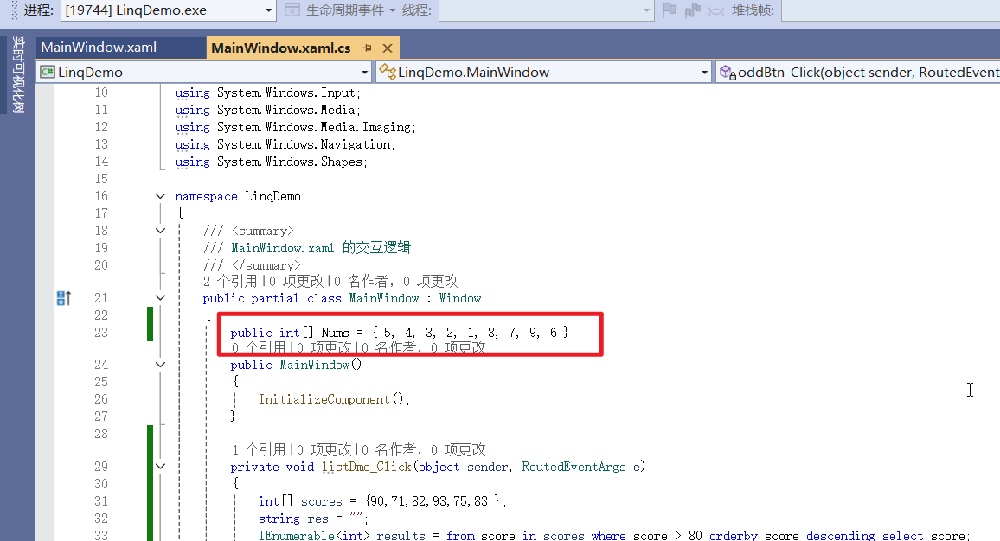

## 然后添加按钮的点击事件代码

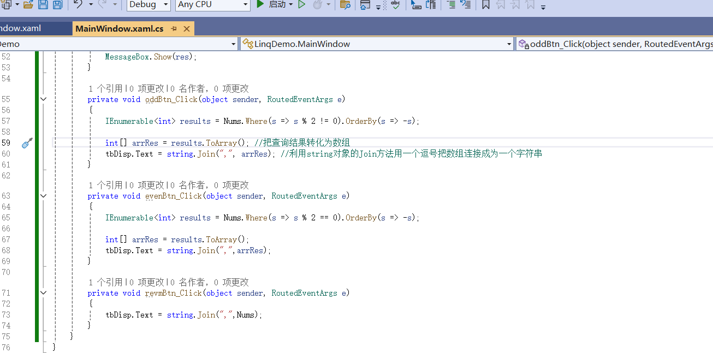

## 4.运行程序，效果如下

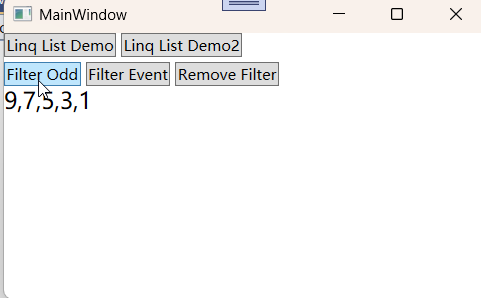

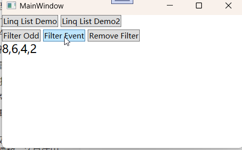

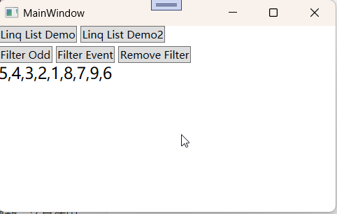


## 参考：老师的代码，有点麻烦

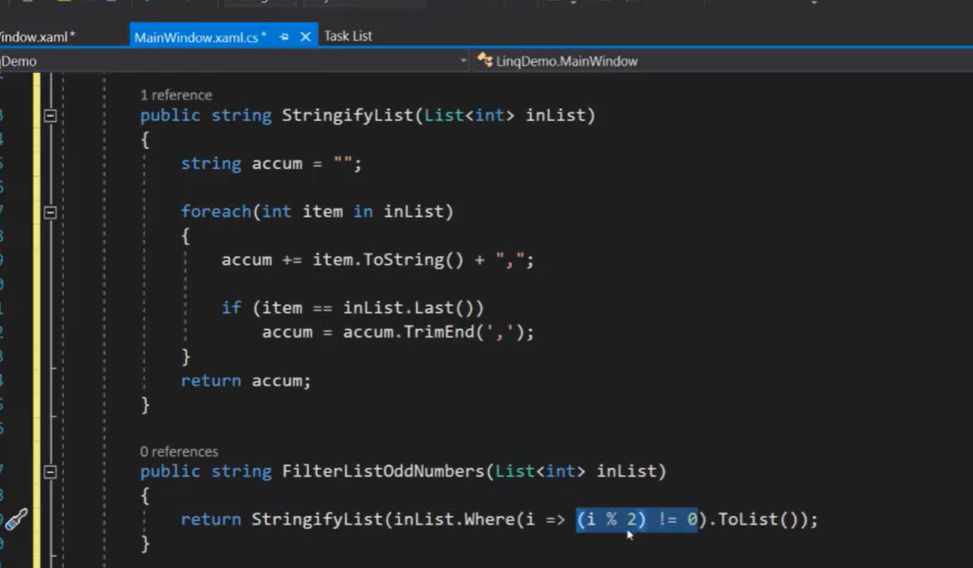

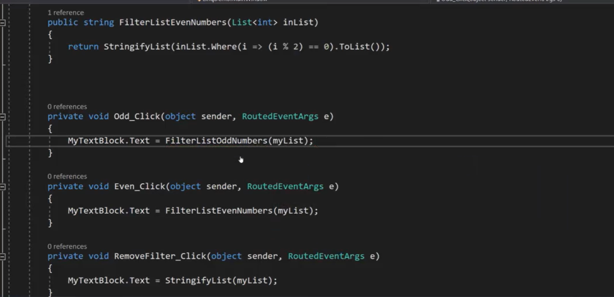


# 7.linq2，使用linq对列表排序

## 其实上面我们语句使用过了。我们也可以添加一个StackPanel然后添加2个按钮来复习一下数组排序，其实只需要使用OrderBy就行了。

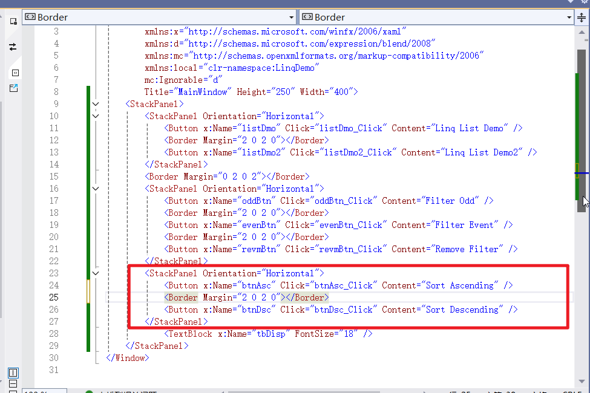

## 然后我们来添加按钮的点击事件处理代码

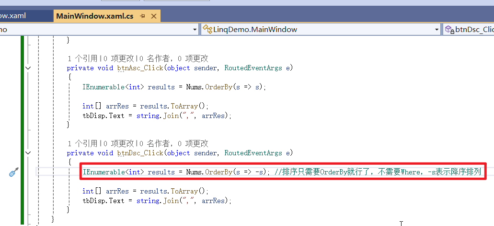

## 注意：降序排列还有一个方法：OrderByDescending

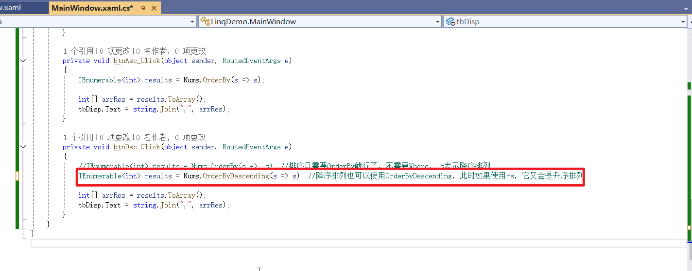

## 运行程序，效果如下

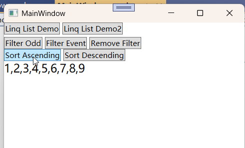


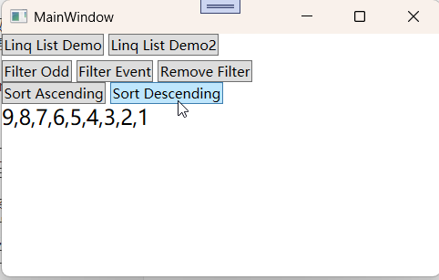

## 注意只是要Labda表达式的linq写法可能更加常用


# 8.语音合成器

## 1.新建一个项目，起名text-to-speech

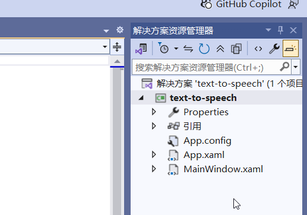

## 2.添加扩展模块，在项目文件上面点击右键-》管理nuget程序包


## 3.就会打开一个安装Nuget包的窗口，点击浏览选项卡，然后输入speech，就会出现一些语音合成包，选择System.Speech,然后点击右边的安装按钮，就可以安装了


## 4.勾选不再显示此消息，然后点击应用，就可以继续安装


## 5.安装成功后如图


## 6.回到MainWindow.Xaml,我们来设计界面，界面如下，我们把文本框的边框宽度设置为0，这样子它就没有边框了


## 7.回到后台代码，我们来编写按钮的事件事件处理函数，首先，需要输入语音库


## 8.然后创建一个SpeechSynthesizer的私有变量


## 9.然后在Window类的构造函数中实例化这个对象，并且设置它的一些属性


## 10.然后我们在按钮的事件事件处理函数里面先检查有没有需要朗读的文本，如果没有，提示用户输入，如果有，就直接调用语音合成器对象的Speak方法，直接把文本框的文本作为参数传递进去即可


## 如果你有兴趣，可以添加一些按钮或者滑块来设置语音合成器的一些属性比如音量，语速等等


# 扩展1，linq开始入门指南

## LINQ介绍

LINQ语言集成查询是一系列直接将查询功能集成到 C# 语言的技术统称。数据查询历来都表示为简单的字符串，没有编译时类型检查或 IntelliSense 支持。此外，需要针对每种类型的数据源了解不同的查询语言：SQL 数据库、XML 文档、各种 Web 服务等。然而，LINQ的出现改变了这一现状，它使查询成为了与类、方法和事件同等重要的高级语言构造。通过LINQ，开发者能够以声明性的方式查询和操作数据，极大地提高了开发效率和代码的可维护性。

## LINQ具有以下特性

- 强类型：编译时验证查询逻辑，减少运行时错误。
- 延迟执行：LINQ查询通常是延迟执行的，即查询表达式本身不会立即执行，直到实际遍历结果时才触发查询。使用 `ToList()`、`ToArray()`、`ToDictionary()`、`FirstOrDefault()`等方法可立即执行。
- 支持多种数据源：LINQ可以用于查询多种数据源，如`LINQ to Objects、LINQ to XML、LINQ to SQL、LINQ to Entities（Entity Framework）`等。

## LINQ中常用方法

### 操作示例数据

```
        public class StudentInfo
        {
            public int StudentID { get; set; }
            public string StudentName { get; set; }
            public DateTime Birthday { get; set; }
            public int ClassID { get; set; }
            public string Address { get; set; }
            public List<Course> Courses { get; set; } = new List<Course>();
        }

        public class Course
        {
            public int CourseID { get; set; }
            public string CourseName { get; set; }
        }

        static List<StudentInfo> students = new List<StudentInfo>
        {
            new StudentInfo
            {
                StudentID=1,
                StudentName="大姚",
                Birthday=Convert.ToDateTime("1997-10-25"),
                ClassID=101,
                Courses = new List<Course>
                {
                    new Course { CourseID = 101, CourseName = "语文" },
                    new Course { CourseID = 102, CourseName = "数学" }
                }
            },
            new StudentInfo
            {
                StudentID=2,
                StudentName="李四",
                Birthday=Convert.ToDateTime("1998-10-25"),
                ClassID=101,
                Courses = new List<Course>
                {
                    new Course { CourseID = 101, CourseName = "语文" },
                    new Course { CourseID = 102, CourseName = "数学" }
                }
            },
            new StudentInfo
            {
                StudentID=3,
                StudentName="王五",
                Birthday=Convert.ToDateTime("1999-10-25"),
                ClassID=102,
                Address="广州",
                Courses = new List<Course>
                {
                    new Course { CourseID = 101, CourseName = "语文" },
                    new Course { CourseID = 102, CourseName = "数学" }
                }
            },
            new StudentInfo
            {
                StudentID=4,
                StudentName="时光者",
                Birthday=Convert.ToDateTime("1999-11-25"),
                ClassID=102,
                Address="深圳" ,
                Courses = new List<Course>
                {
                    new Course { CourseID = 104, CourseName = "历史" },
                    new Course { CourseID = 103, CourseName = "地理" }
                }
            }
        };
```

### 基本查询方法

- **Where**：用于过滤集合中的元素，通过一个谓词（返回布尔值的条件）筛选集合中的元素，生成一个仅包含满足条件元素的新序列。
- **Select**：用于将集合中的每个元素投影（转换）为新序列。
- **SelectMany**：用于将多个集合（嵌套集合，如集合的集合）`展平`为一个集合。

```
            var femaleStudents = students.Where(s => s.StudentName == "时光者");
            var studentNames = students.Select(s => s.StudentName);

            // 使用SelectMany展平所有学生的课程列表
            var allCourses = students.SelectMany(student => student.Courses).ToList();

            // 输出所有课程的名称
            foreach (var course in allCourses)
            {
                Console.WriteLine(course.CourseName);
            }
```

### 转换方法

- **ToList**：将实现了`IEnumerable<T>`接口的集合转换为一个`List<T>`类型的对象，属于将集合转换为特定类型列表的方法。
- **ToArray**：将一个实现了`IEnumerable<T>`接口的集合转换为一个数组，属于将集合转换为数组类型的方法。
- **ToDictionary**：将一个`IEnumerable<T>`集合转换为一个`Dictionary<TKey,TValue>`键值对集合（字典）的方法，注意 ToDictionary 要求键唯一，否则抛出异常。
- **ToLookup**：将一个`IEnumerable<T>`集合转换为一个泛型`Lookup<TKey,TElement>`，`Lookup<TKey,TElement>`一个一对多字典，用于将键映射到值的集合。

```
            var studentList = students.ToList();
            var studentArray = students.ToArray();
            var studentDictionary = students.ToDictionary(s => s.StudentID, s => s.StudentName);
            var studentLookup = students.ToLookup(s => s.ClassID, s => s.StudentName);
```

### 元素操作方法

- **First**：返回集合中的第一个元素。
- **FirstOrDefault**：返回集合中的第一个元素，如果集合中未找到该元素，则返回默认值。
- **Single**：返回集合中的单个元素，如果集合中未找到该元素或包含多个元素则抛出异常。
- **SingleOrDefault**：返回集合中的单个元素，如果集合中未找到该元素，则返回默认值；如果该集合中包含多个元素，此方法将引发异常。
- **Last**：返回集合中的最后一个元素。
- **LastOrDefault**：返回集合中的最后一个元素，如果集合中未找到该元素，则返回默认值。
- **ElementAt**：返回集合中指定索引处的元素。
- **ElementAtOrDefault**：返回集合中指定索引处的元素，如果索引超出范围则返回默认值。
- **DefaultIfEmpty**：如果集合为空，则返回一个包含默认值的集合。

```
            var firstStudent = students.First();
            var firstAdult = students.FirstOrDefault(s => s.Birthday <= DateTime.Now.AddYears(-18));
            var onlyWangWu = students.Single(s => s.StudentName == "王五");
            var wangWuOrDefault = students.SingleOrDefault(s => s.StudentName == "王六");
            var lastStudent = students.Last();
            var lastAdult = students.LastOrDefault(s => s.Birthday <= DateTime.Now.AddYears(-18));
            var secondStudent = students.ElementAt(1);
            var tenthStudentOrDefault = students.ElementAtOrDefault(9);
            var nonEmptyStudents = students.DefaultIfEmpty(new StudentInfo { StudentID = 0, StudentName = "默认Student", Address = "默认" });
```

### 排序方法

- **OrderBy**：用于对集合进行升序排序。
- **OrderByDescending**：用于对集合进行降序排序。
- **ThenBy**：按升序对集合中的元素执行后续排序。
- **ThenByDescending**：按降序对集合中的元素执行后续排序。

```
            var sortedByBirthdayAsc = students.OrderBy(s => s.Birthday);
            var sortedByClassIDDesc = students.OrderByDescending(s => s.ClassID);
            var sortedByNameThenClassID = students.OrderBy(s => s.StudentName).ThenBy(s => s.ClassID);
            var sortedThenByDescending = students.OrderBy(s => s.StudentName).ThenBy(s => s.ClassID).ThenByDescending(x => x.Birthday);
```

### 聚合方法

- **Count**：返回集合中的元素数量。
- **Sum**：返回集合中数值类型元素的和。
- **Average**：返回集合中数值类型元素的平均值。
- **Min**：返回集合中的最小值。
- **Max**：返回集合中的最大值。
- **Aggregate**：对集合进行自定义聚合操作。

```
            int studentCount = students.Count();
            int totalClassID = students.Sum(s => s.ClassID);
            double averageAge = students.Average(s => DateTime.Now.Year - s.Birthday.Year);
            int minClassID = students.Min(s => s.ClassID);
            int maxClassID = students.Max(s => s.ClassID);
            string concatenatedNames = students.Aggregate("", (acc, s) => acc == "" ? s.StudentName : acc + ", " + s.StudentName);
```

### 集合操作方法

- **Distinct**：返回集合中的唯一元素（去除重复项）。
- **Union**：返回两个集合的并集（合并后去重）。
- **Intersect**：返回两个集合的交集（共有的唯一元素）。
- **Except**：返回在第一个集合中存在但不在第二个集合中存在的元素（取集合的差集）。
- **Concat**：连接两个集合，返回一个新的序列（保留所有元素，包括重复项）。

```
            var uniqueClassIDs = students.Select(s => s.ClassID).Distinct();
            var unionClassIDs = uniqueClassIDs.Union(new[] { 103, 104 });
            var intersectClassIDs = uniqueClassIDs.Intersect(new[] { 101, 103 });
            var exceptClassIDs = uniqueClassIDs.Except(new[] { 101 });
            var concatClassIDs = uniqueClassIDs.Concat(new[] { 103, 104 });
```

### 分组与连接方法

- **GroupBy**：对集合中的元素进行分组。
- **Join**：基于匹配键对两个集合的元素进行关联。
- **GroupJoin**：基于键值等同性将两个集合的元素进行关联，并对结果进行分组。

```
            var groupedByClassID = students.GroupBy(s => s.ClassID);

            foreach (var group in groupedByClassID)
            {
                Console.WriteLine($"班级ID: {group.Key}");
                foreach (var student in group)
                {
                    Console.WriteLine($"  学生姓名: {student.StudentName}");
                }
            }

            // 连接两个集合（内连接查询）
            var otherStudent = new List<StudentInfo>
            {
               new StudentInfo
               {
                   StudentID=4,
                   StudentName="摇一摇",
                   Birthday=Convert.ToDateTime("1997-10-25"),
                   ClassID=101,
                   Courses = new List<Course>
                   {
                       new Course { CourseID = 101, CourseName = "语文" },
                       new Course { CourseID = 102, CourseName = "数学" }
                   }
               }
            };

            var listJoin = students.Join(
                otherStudent, // 要连接的第二个集合
                s1 => s1.StudentID, // 从第一个集合中提取键
                s2 => s2.StudentID, // 从第二个集合中提取键
                (s1, s2) => new // 结果选择器，指定如何从两个匹配元素创建结果
                {
                    StudentID = s1.StudentID,
                    StudentName = s1.StudentName,
                    Birthday = s1.Birthday,
                    ClassID = s1.ClassID,
                    Address = s1.Address,
                    Courses = s1.Courses,
                    OtherStudentName = s2.StudentName
                });

            //使用 GroupJoin 方法实现两个集合的左连接（Left Join）
            //目标：获取所有课程及选修学生（即使无人选修也要显示课程）
            var courseStudentGroups = courses.GroupJoin(
                students.SelectMany(
                    student => student.Courses,
                    (student, course) => new { Student = student, Course = course }
                ),
                course => course.CourseID,
                studentCoursePair => studentCoursePair.Course.CourseID,
                // 结果投影：生成课程名称及对应的学生列表
                (course, matchedStudents) => new
                {
                    CourseName = course.CourseName,
                    Students = matchedStudents
                        .Select(pair => pair.Student.StudentName)
                        .DefaultIfEmpty("（无学生）")
                        .ToList()
                }
            ).ToList();

            // 输出结果
            foreach (var group in courseStudentGroups)
            {
                Console.WriteLine("-------------------");
                Console.WriteLine($"课程：{group.CourseName}");
                Console.WriteLine($"选修学生：{string.Join(", ", group.Students)}");
                Console.WriteLine("-------------------");
            }
```

### 跳过与获取指定数量的元素（常用作分页）

- **Skip**：用于跳过集合中指定数量的元素，并返回剩余的元素序列。
- **Take**：用于从集合的开头获取指定数量的元素，并返回一个新的序列。

```
            var skippedStudents = students.Skip(1);
            var takenStudents = students.Take(2);

            //数据分页查询（Skip + Take）
            int pageNumber = 2;
            int pageSize = 10;
            var pagedUsers = skippedStudents
                .OrderBy(u => u.ClassID) // 必须排序
                .Skip((pageNumber - 1) * pageSize)
                .Take(pageSize)
                .ToList();
```

### 条件判断方法

- **All**：判断集合中的所有元素是否都满足条件。
- **Any**：判断集合中是否包含元素或存在元素满足指定条件。
- **Contains**：用于判断集合中是否包含指定的元素。

```
            bool allAdults = students.All(s => s.Birthday <= DateTime.Now.AddYears(-18));
            bool anyAdults = students.Any(s => s.Birthday <= DateTime.Now.AddYears(-18));
            bool containsWangWu = students.Contains(students.First(s => s.StudentName == "王五"));
```

### 更多方法查询

- https://learn.microsoft.com/zh-cn/dotnet/csharp/linq/get-started/introduction-to-linq-queries#classification-table


## 查询语法

LINQ提供了类似于SQL的查询语法，允许开发者以几乎相同的方式对不同类型的数据源进行查询。查询语法使用from、where、select、orderby等关键字。

```
            var querySyntaxResult = from student in students
                                    where student.ClassID == 101
                                    orderby student.StudentName ascending
                                    select student;

            Console.WriteLine("查询语法结果:");
            foreach (var student in querySyntaxResult)
            {
                Console.WriteLine($"{student.StudentName}, ClassID: {student.ClassID}");
            }
```

**查询关键字：**

- **from：** 指定数据源和范围变量（类似于迭代变量）。
- **where：** 基于由逻辑 AND 和 OR 运算符（&& 或 ||）分隔的一个或多个布尔表达式筛选源元素。
- **select：** 指定执行查询时，所返回序列中元素的类型和形状。
- **group：** 根据指定的密钥值对查询结果分组。
- **into：** 提供可作为对 join、group 或 select 子句结果引用的标识符（简单理解用于将配对的结果收集到一个临时序列）。
- **orderby：** 根据元素类型的默认比较器对查询结果进行升序或降序排序。
- **join：** 基于两个指定匹配条件间的相等比较而联接两个数据源（简单理解根据指定的键将两个序列中的元素配对）。
- **let：** 引入范围变量，在查询表达式中存储子表达式结果。
- **in：** join子句中的上下文关键字。
- **on：** join子句中的上下文关键字。
- **equals：** join子句中的上下文关键字。
- **by：** group 子句中的上下文关键字。
- **ascending：** orderby子句中的上下文关键字。
- **descending：** orderby子句中的上下文关键字。

## 方法语法

方法语法也称为扩展方法语法，使用点号“.”和一系列扩展方法来构建查询。

```
            var methodSyntaxResult = students
                                    .Where(student => student.ClassID == 101)
                                    .OrderBy(student => student.StudentName)
                                    .ToList();


            Console.WriteLine("方法语法结果:");
            foreach (var student in methodSyntaxResult)
            {
                Console.WriteLine($"{student.StudentName}, ClassID: {student.ClassID}");
            }
```

## 混合查询和方法语法

```
            var mixedResult = (from student in students
                               where student.ClassID == 101
                               where student.Courses.Any(course => course.CourseName == "数学")
                               orderby student.StudentName ascending
                               select student)
                       .Take(2)
                       .ToList();

            // 输出结果
            Console.WriteLine("混合查询结果:");
            foreach (var student in mixedResult)
            {
                Console.WriteLine($"{student.StudentName}, ClassID: {student.ClassID}");
            }
```

## 参考文章

- https://learn.microsoft.com/zh-cn/dotnet/csharp/linq
- https://learn.microsoft.com/zh-cn/dotnet/csharp/language-reference/keywords/query-keywords

## DotNetGuide技术社区

- DotNetGuide技术社区是一个面向.NET开发者的开源技术社区，旨在为开发者们提供全面的C#/.NET/.NET Core相关学习资料、技术分享和咨询、项目框架推荐、求职和招聘资讯、以及解决问题的平台。
- 在DotNetGuide技术社区中，开发者们可以分享自己的技术文章、项目经验、学习心得、遇到的疑难技术问题以及解决方案，并且还有机会结识志同道合的开发者。
- 我们致力于构建一个积极向上、和谐友善的.NET技术交流平台。无论您是初学者还是有丰富经验的开发者，我们都希望能为您提供更多的价值和成长机会。

# 扩展2，LINQ详解(查询表达式)

## https://zhuanlan.zhihu.com/p/653586431


