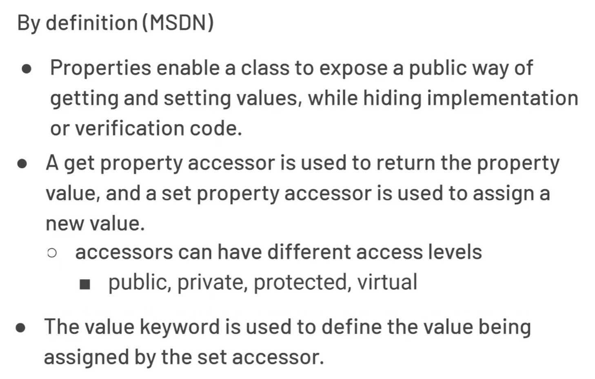
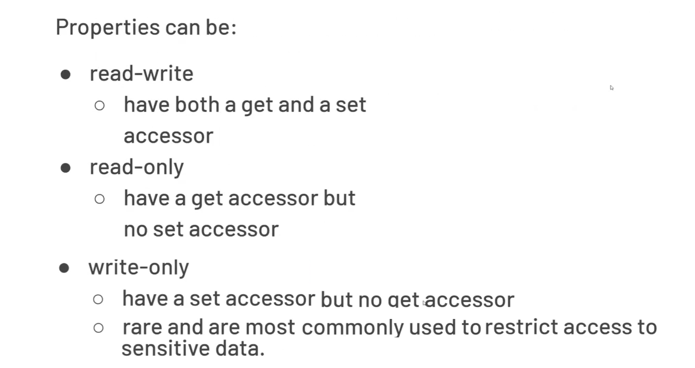
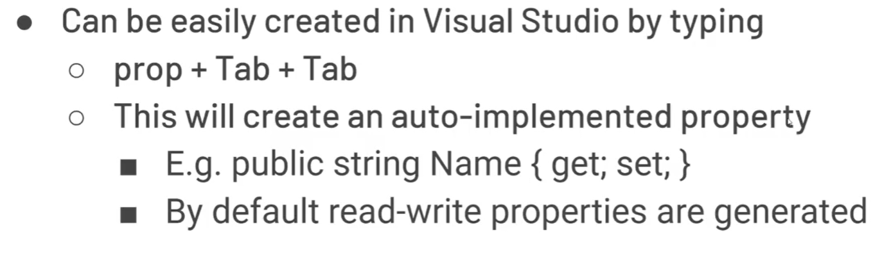
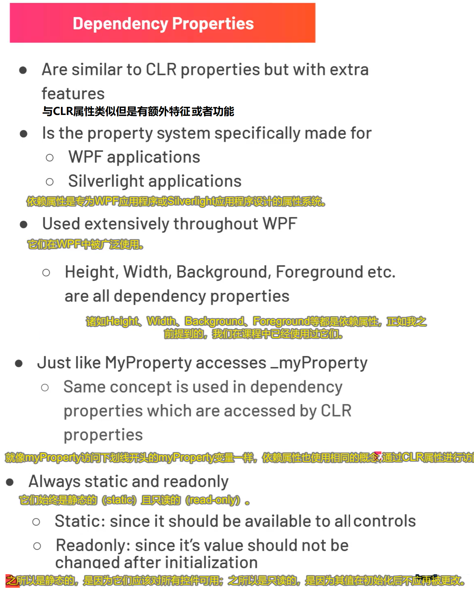
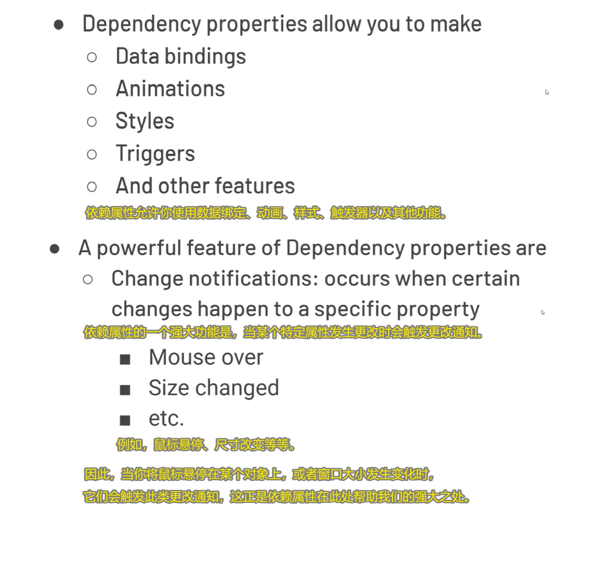
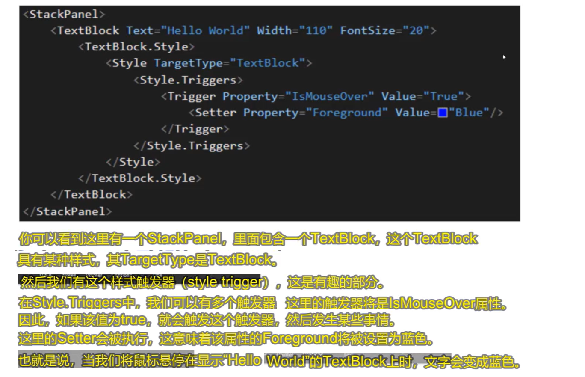
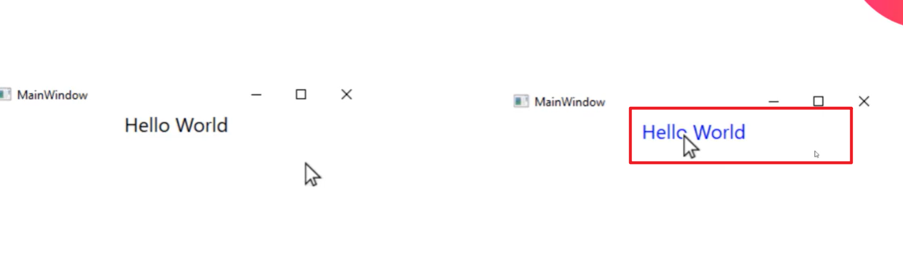
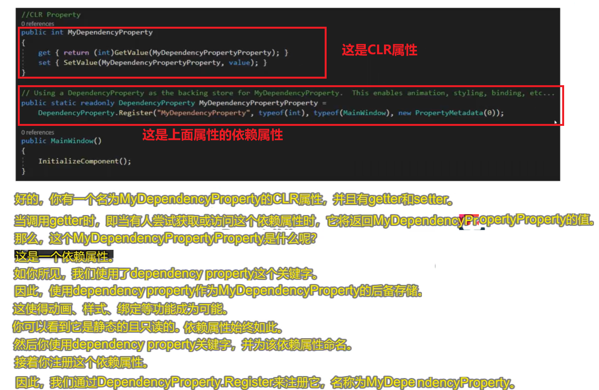
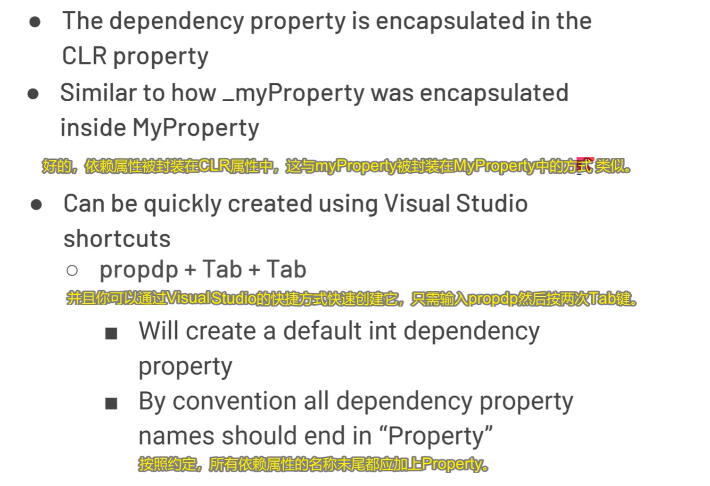
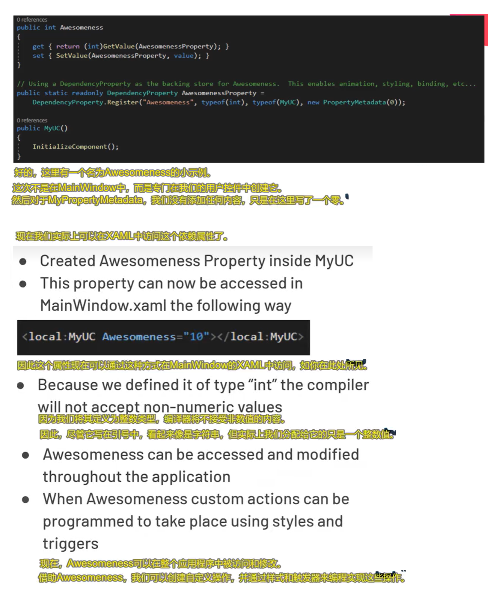

# 1.依赖属性介绍

## 1》CLR属性

所谓的clr属性就是一个公共的有setter和getter或者只有getter，能够在里面操作一个私有字段的成员。如下图，_myProperty

是私有字段，MyProperty就是属性，属性必须是公有的。

### 属性的MSDN定义

### 属性的特点

### 如何创建属性

## 2.依赖属性

### 什么是依赖属性以及他的特点

### 依赖属性的用途

## 3》xaml中依赖属性的使用

#### 效果对比

#### 这个xaml代码的csharp等效代码

## 4》在csharp中定义依赖属性的正确做法

## 注意：

## 小示例

# 2.使用依赖属性

# 3.创建我们自己的依赖属性并且使用

