# 1.打开文件并且显示内容

## 1.新建一个项目，起名：WpfSimpleFileDemo，用来学习打开文件和保存文件功能

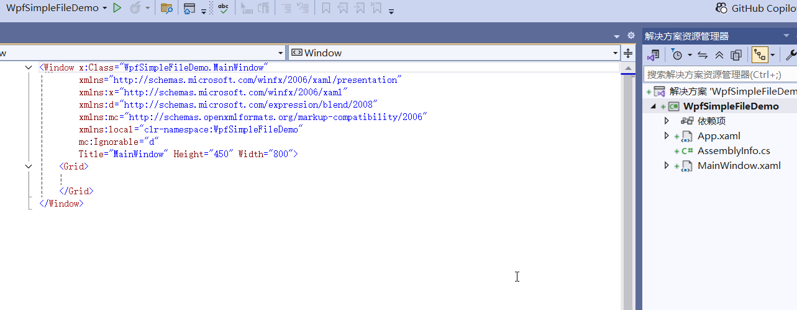

## 我们给项目添加一些图片，用来做菜单的Icon，需要把每一幅图片设置为内容，并且设置较新则复制

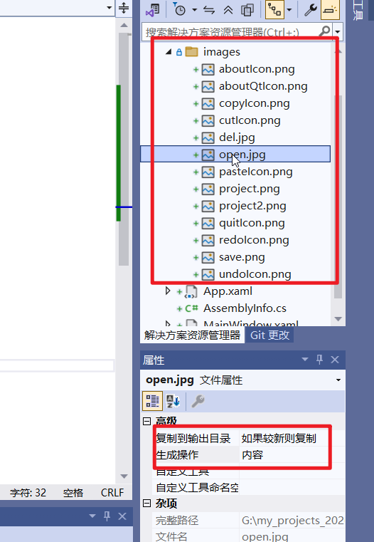

## 2.然后我们添加一个文件菜单，并且给他添加2个子菜单：打开和保存，并且给他们添加点击事件处理函数，然后我们在菜单下面新建一个文本框

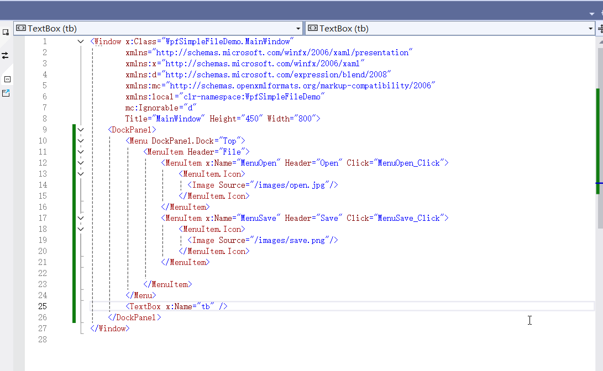

## 3.回到后台代码，我们先来实现打开文件功能。代码如下

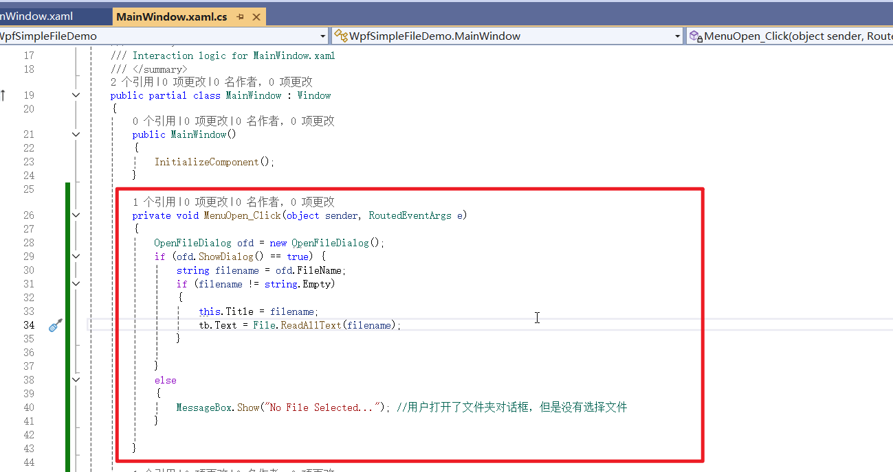

### 效果

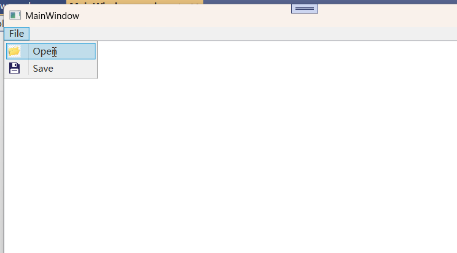

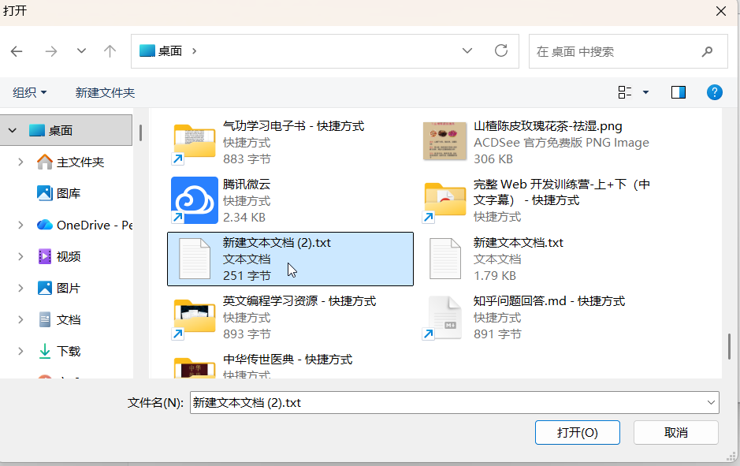

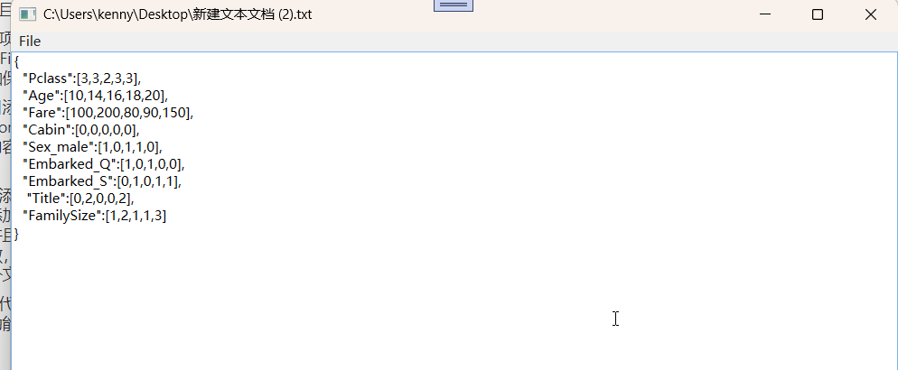

### 至此打开文件读取内容的功能就实现了，我们下一节学习在文件对话框里面添加过滤功能

# 2.打开文件对话框的过滤功能

## 1.还是上面的项目，我们先来学习如何打开一个特文件夹，它是通过Environment.SpecialFolder.xx来获取，有很多，如图

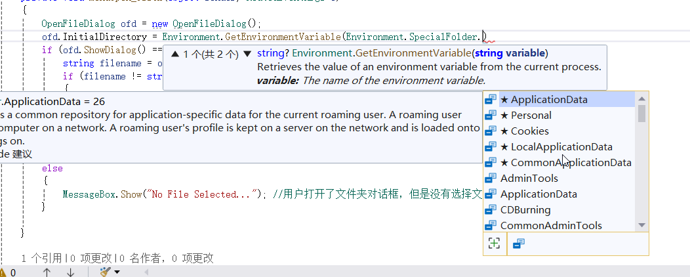

## 比如，我们把打开对话框的默认路径设置为文档文件夹(其实只是默认值)

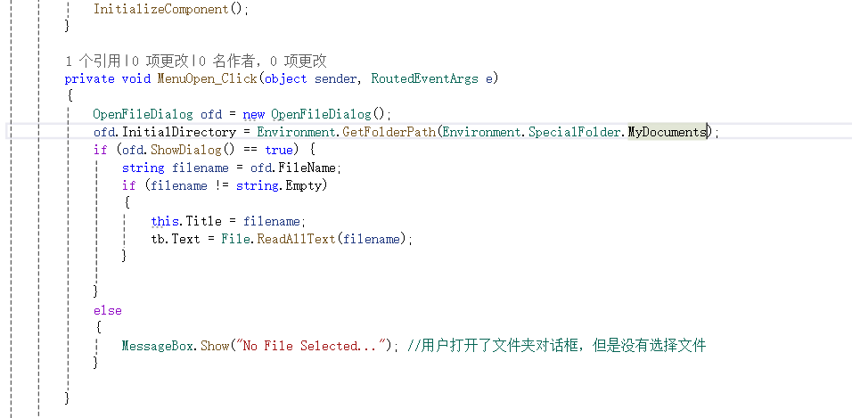

## 2.当然，我们也可以给他指定一个路径，比如d:\，还可以获取当前源码文件所在的路径

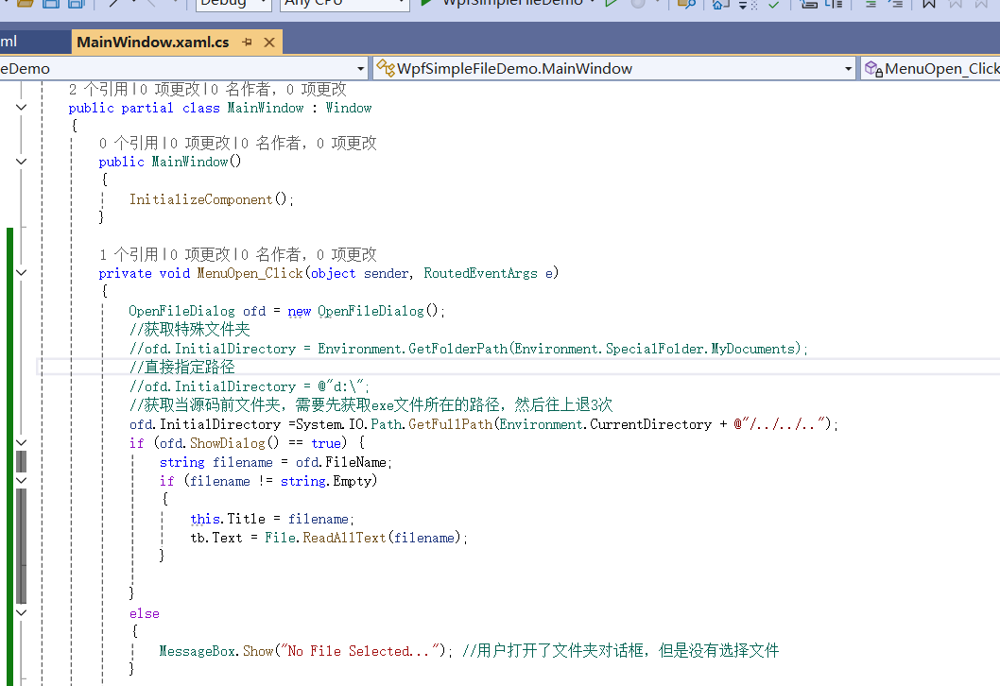

## 3.然后，我们可以来所在打开对话框的文件类型过滤器

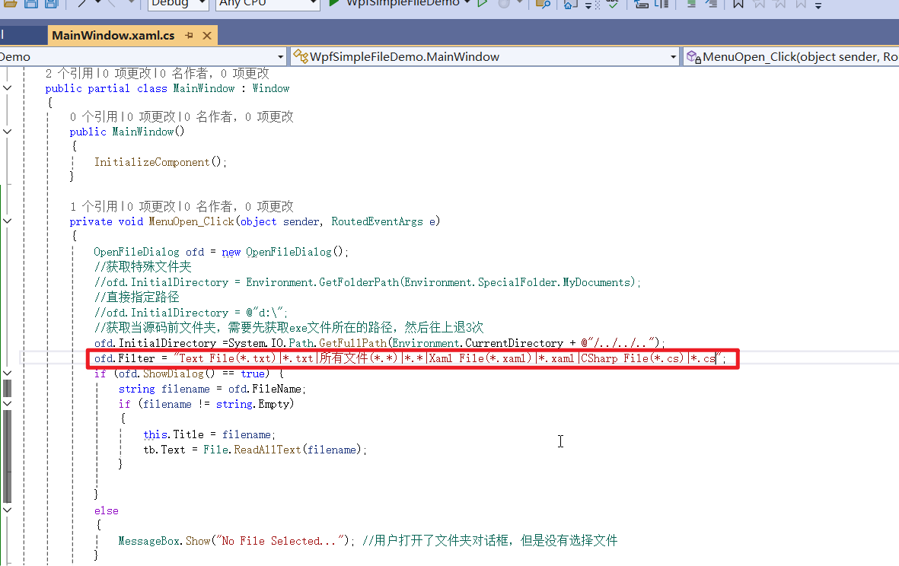

### 过滤器的效果

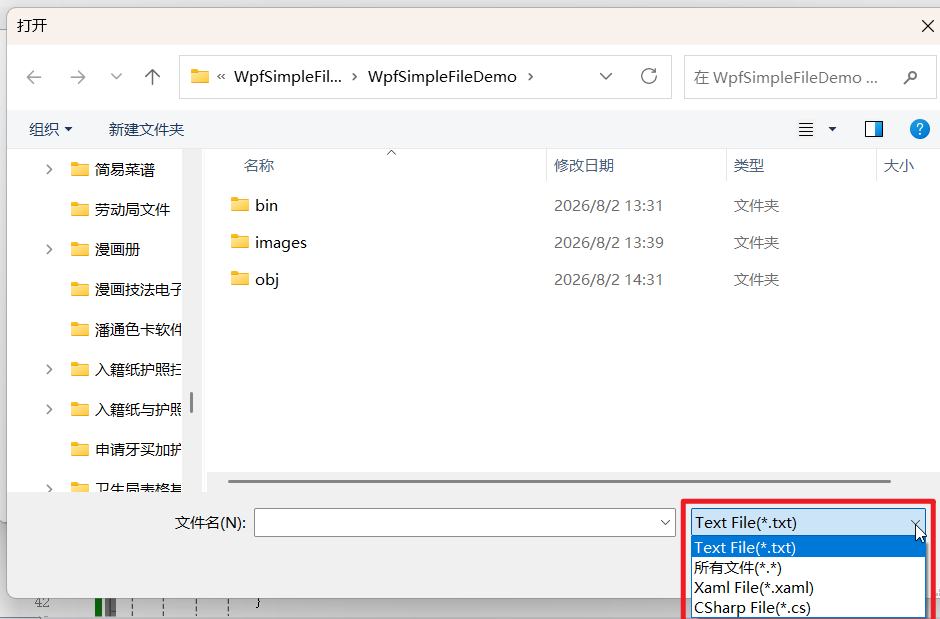

### 下一节，我们来学习保存文件

# 3.保存文本文件

## 1.还是上面的项目，我们来给保存菜单点击事件处理函数添加实现代码

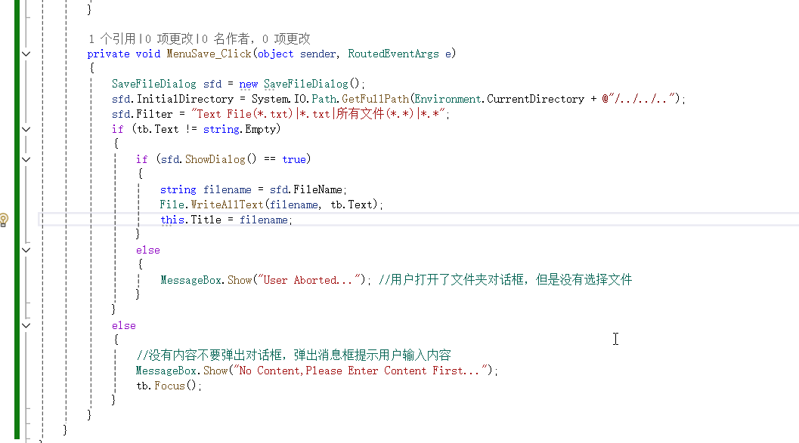

### 效果

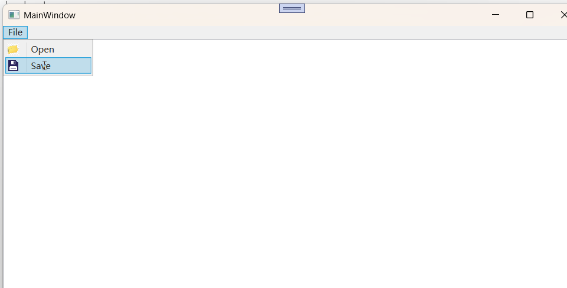

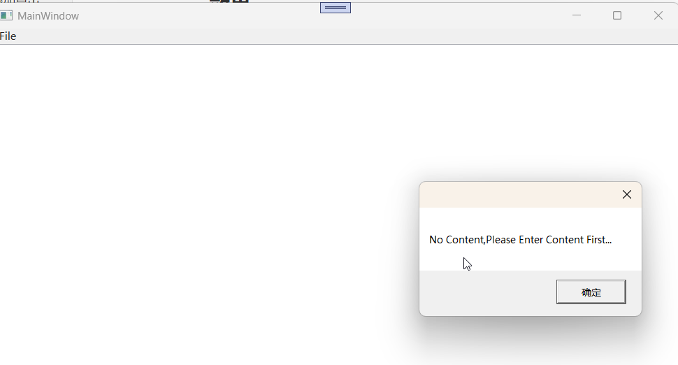

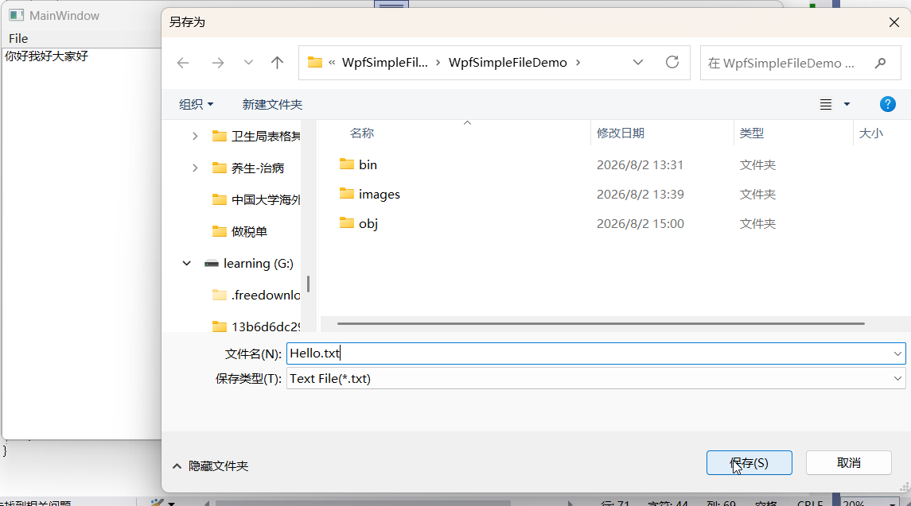

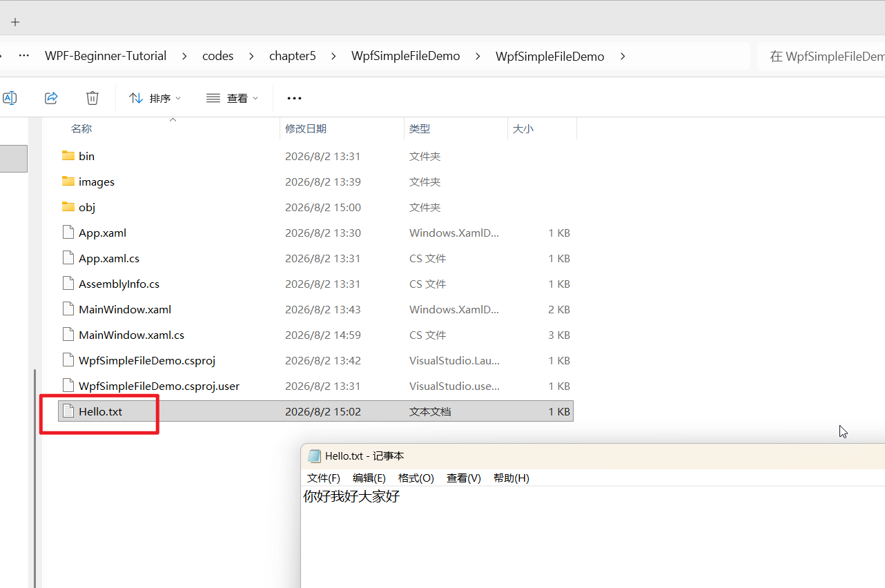